# OMS — Missing Tables (Addendum to version-2-seating)

These 25 entities are required by the OMS Data Model Document (v1.0) but are absent from `version-2-seating.md`.
Relationship lines that reference `EMPLOYEE`, `OFFICE_BUILDING`, `SEAT_BOOKING`, `OOO_REQUEST`,
`REMOTE_REQUEST`, and `WORK_SESSION` point to tables already defined in `version-2-seating.md`.

---

```mermaid
erDiagram

  %% ─────────────────────────────────────────────────────
  %% 1. ATTENDANCE MANAGEMENT
  %% ─────────────────────────────────────────────────────

  ATTENDANCE_RECORD {
    uuid record_id PK
    uuid employee_id FK
    uuid building_id FK
    date record_date
    enum status
    uuid work_session_id FK
    uuid remote_request_id FK
    uuid leave_request_id FK
    bool is_overridden
    uuid override_by FK
    string override_reason
    timestamp created_at
    timestamp updated_at
  }

  PUBLIC_HOLIDAY {
    uuid holiday_id PK
    uuid building_id FK
    date holiday_date
    string name
    timestamp created_at
    timestamp updated_at
  }

  %% ─────────────────────────────────────────────────────
  %% 2. SEATING — NO-SHOW TRACKING
  %% ─────────────────────────────────────────────────────

  NO_SHOW_RECORD {
    uuid no_show_id PK
    uuid seat_booking_id FK
    uuid employee_id FK
    uuid building_id FK
    date no_show_date
    timestamp created_at
  }

  %% ─────────────────────────────────────────────────────
  %% 3. REMOTE DAY & OOO — POLICY + DELEGATION
  %% ─────────────────────────────────────────────────────

  REMOTE_DAY_POLICY {
    uuid policy_id PK
    uuid building_id FK
    uuid manager_id FK
    int max_remote_days_per_week
    enum enforcement_mode
    timestamp created_at
    timestamp updated_at
  }

  APPROVAL_DELEGATE {
    uuid delegate_id PK
    uuid manager_id FK
    uuid delegated_to_id FK
    uuid building_id FK
    date effective_from
    date effective_to
    uuid ooo_request_id FK
    bool is_active
    timestamp created_at
    timestamp updated_at
  }

  %% ─────────────────────────────────────────────────────
  %% 4. VISITOR MANAGEMENT
  %% ─────────────────────────────────────────────────────

  VISITOR_PROFILE {
    uuid profile_id PK
    string first_name
    string last_name
    string email
    string phone
    string company
    uuid created_by FK
    timestamp created_at
    timestamp updated_at
    timestamp deleted_at
  }

  PARENT_VISIT {
    uuid visit_id PK
    uuid visitor_profile_id FK
    uuid host_employee_id FK
    uuid building_id FK
    string purpose
    date start_date
    date end_date
    enum access_level
    string notes
    timestamp created_at
    timestamp updated_at
  }

  VISIT_RECORD {
    uuid record_id PK
    uuid parent_visit_id FK
    uuid visitor_profile_id FK
    uuid host_employee_id FK
    uuid building_id FK
    date visit_date
    time expected_arrival_time
    timestamp actual_check_in
    timestamp actual_check_out
    enum status
    bool is_walk_in
    bool agreement_signed
    timestamp agreement_signed_at
    uuid agreement_template_id FK
    uuid checked_in_by FK
    timestamp created_at
    timestamp updated_at
  }

  AGREEMENT_TEMPLATE {
    uuid template_id PK
    uuid building_id FK
    string title
    text content
    bool is_active
    uuid created_by FK
    timestamp created_at
    timestamp updated_at
  }

  %% ─────────────────────────────────────────────────────
  %% 5. OFFICE EVENT MANAGEMENT
  %% ─────────────────────────────────────────────────────

  EVENT_SERIES {
    uuid series_id PK
    uuid building_id FK
    uuid organiser_id FK
    string title
    string description
    enum recurrence_type
    int recurrence_interval
    string recurrence_day
    date series_start_date
    date series_end_date
    timestamp created_at
    timestamp updated_at
  }

  EVENT {
    uuid event_id PK
    uuid event_series_id FK
    uuid building_id FK
    uuid organiser_id FK
    string title
    string description
    date event_date
    time start_time
    time end_time
    string room_reference
    int capacity
    enum status
    string cancellation_reason
    timestamp cancelled_at
    bool is_series_detached
    timestamp created_at
    timestamp updated_at
  }

  EVENT_INVITE {
    uuid invite_id PK
    uuid event_id FK
    uuid employee_id FK
    uuid visit_record_id FK
    enum rsvp_status
    timestamp rsvp_at
    bool is_waitlisted
    int waitlist_position
    timestamp waitlist_joined_at
    timestamp created_at
    timestamp updated_at
  }

  %% ─────────────────────────────────────────────────────
  %% 6. OFFICE SUPPLIES MANAGEMENT
  %% ─────────────────────────────────────────────────────

  SUPPLY_CATEGORY {
    uuid category_id PK
    string name
    bool has_expiry
    timestamp created_at
    timestamp updated_at
  }

  SUPPLY_ITEM {
    uuid item_id PK
    uuid building_id FK
    uuid category_id FK
    string name
    string description
    string unit_of_measure
    enum allocation_type
    decimal current_stock
    decimal low_stock_threshold
    decimal reorder_quantity
    bool is_active
    timestamp created_at
    timestamp updated_at
  }

  SUPPLY_STOCK_ENTRY {
    uuid entry_id PK
    uuid supply_item_id FK
    uuid building_id FK
    decimal quantity
    date expiry_date
    int expiry_alert_days
    enum status
    timestamp disposed_at
    uuid disposed_by FK
    timestamp received_at
    timestamp created_at
    timestamp updated_at
  }

  SUPPLY_REQUEST {
    uuid request_id PK
    uuid supply_item_id FK
    uuid requester_id FK
    uuid building_id FK
    decimal quantity
    string purpose
    enum status
    uuid manager_reviewed_by FK
    timestamp manager_reviewed_at
    string manager_rejection_reason
    uuid facilities_reviewed_by FK
    timestamp facilities_reviewed_at
    string facilities_rejection_reason
    timestamp fulfilled_at
    timestamp created_at
    timestamp updated_at
  }

  REORDER_LOG {
    uuid log_id PK
    uuid supply_item_id FK
    uuid building_id FK
    timestamp triggered_at
    enum triggered_by
    decimal stock_level_at_trigger
    decimal reorder_quantity
    jsonb procurement_response
    enum status
    timestamp created_at
  }

  %% ─────────────────────────────────────────────────────
  %% 7. OFFICE ASSETS MANAGEMENT
  %% ─────────────────────────────────────────────────────

  ASSET_CATEGORY {
    uuid category_id PK
    string name
    int default_lifespan_months
    timestamp created_at
    timestamp updated_at
  }

  ASSET {
    uuid asset_id PK
    uuid category_id FK
    uuid building_id FK
    string asset_tag
    string serial_number
    string name
    string description
    enum condition
    enum status
    date purchase_date
    decimal purchase_value
    date warranty_expiry
    date next_service_date
    timestamp retired_at
    enum retirement_reason
    timestamp created_at
    timestamp updated_at
    timestamp deleted_at
  }

  ASSET_ASSIGNMENT {
    uuid assignment_id PK
    uuid asset_id FK
    uuid assigned_to_employee_id FK
    string assigned_to_space
    uuid building_id FK
    uuid assigned_by FK
    timestamp assigned_at
    timestamp acknowledged_at
    timestamp returned_at
    enum return_condition
    uuid asset_request_id FK
    bool is_active
    timestamp created_at
    timestamp updated_at
  }

  ASSET_REQUEST {
    uuid request_id PK
    uuid requester_id FK
    uuid category_id FK
    uuid building_id FK
    string justification
    enum status
    uuid manager_reviewed_by FK
    timestamp manager_reviewed_at
    string manager_rejection_reason
    uuid facilities_reviewed_by FK
    timestamp facilities_reviewed_at
    string facilities_rejection_reason
    timestamp fulfilled_at
    timestamp created_at
    timestamp updated_at
  }

  MAINTENANCE_RECORD {
    uuid record_id PK
    uuid asset_id FK
    uuid building_id FK
    enum maintenance_type
    enum performed_by_type
    string performed_by_name
    string description
    enum outcome
    date maintenance_date
    date next_service_date
    decimal cost
    uuid fault_report_id FK
    timestamp created_at
    timestamp updated_at
  }

  FAULT_REPORT {
    uuid report_id PK
    uuid asset_id FK
    uuid reported_by FK
    uuid building_id FK
    enum fault_type
    string description
    enum status
    uuid resolved_by FK
    timestamp resolved_at
    enum resolution_outcome
    timestamp created_at
    timestamp updated_at
  }

  %% ─────────────────────────────────────────────────────
  %% 8. GLOBAL — AUDIT & NOTIFICATIONS
  %% ─────────────────────────────────────────────────────

  AUDIT_LOG {
    uuid log_id PK
    uuid actor_id FK
    enum actor_role
    string action
    string entity_type
    uuid entity_id
    uuid building_id FK
    jsonb previous_state
    jsonb new_state
    timestamp occurred_at
  }

  NOTIFICATION {
    uuid notification_id PK
    uuid recipient_id FK
    enum type
    string title
    string body
    string deep_link
    bool is_read
    timestamp created_at
  }

  %% ─────────────────────────────────────────────────────
  %% RELATIONSHIPS — new tables only
  %% (EMPLOYEE, OFFICE_BUILDING, SEAT_BOOKING, OOO_REQUEST,
  %%  REMOTE_REQUEST, WORK_SESSION defined in version-2-seating)
  %% ─────────────────────────────────────────────────────

  %% Attendance
  EMPLOYEE ||--o{ ATTENDANCE_RECORD : has
  OFFICE_BUILDING ||--o{ ATTENDANCE_RECORD : scopes
  WORK_SESSION ||--o| ATTENDANCE_RECORD : resolved_into
  REMOTE_REQUEST ||--o| ATTENDANCE_RECORD : linked_to
  OOO_REQUEST ||--o| ATTENDANCE_RECORD : linked_to
  OFFICE_BUILDING ||--o{ PUBLIC_HOLIDAY : defines

  %% No-show
  SEAT_BOOKING ||--|| NO_SHOW_RECORD : triggers
  EMPLOYEE ||--o{ NO_SHOW_RECORD : recorded_for
  OFFICE_BUILDING ||--o{ NO_SHOW_RECORD : scopes

  %% Remote policy & delegation
  OFFICE_BUILDING ||--o{ REMOTE_DAY_POLICY : configures
  EMPLOYEE ||--o{ REMOTE_DAY_POLICY : managed_by
  EMPLOYEE ||--o{ APPROVAL_DELEGATE : delegates
  EMPLOYEE ||--o{ APPROVAL_DELEGATE : acts_as_delegate
  OOO_REQUEST ||--o| APPROVAL_DELEGATE : triggers
  OFFICE_BUILDING ||--o{ APPROVAL_DELEGATE : scopes

  %% Visitor management
  EMPLOYEE ||--o{ VISITOR_PROFILE : creates
  VISITOR_PROFILE ||--o{ PARENT_VISIT : for
  EMPLOYEE ||--o{ PARENT_VISIT : hosts
  OFFICE_BUILDING ||--o{ PARENT_VISIT : at
  PARENT_VISIT ||--o{ VISIT_RECORD : includes
  VISITOR_PROFILE ||--o{ VISIT_RECORD : for
  EMPLOYEE ||--o{ VISIT_RECORD : hosts
  OFFICE_BUILDING ||--o{ VISIT_RECORD : at
  AGREEMENT_TEMPLATE ||--o{ VISIT_RECORD : signed_at
  OFFICE_BUILDING ||--o{ AGREEMENT_TEMPLATE : owns

  %% Events
  OFFICE_BUILDING ||--o{ EVENT_SERIES : hosts
  EMPLOYEE ||--o{ EVENT_SERIES : organises
  EVENT_SERIES ||--o{ EVENT : generates
  OFFICE_BUILDING ||--o{ EVENT : at
  EMPLOYEE ||--o{ EVENT : organises
  EVENT ||--o{ EVENT_INVITE : has
  EMPLOYEE ||--o{ EVENT_INVITE : invited
  VISIT_RECORD ||--o{ EVENT_INVITE : for_external

  %% Supplies
  SUPPLY_CATEGORY ||--o{ SUPPLY_ITEM : categorises
  OFFICE_BUILDING ||--o{ SUPPLY_ITEM : stocks
  SUPPLY_ITEM ||--o{ SUPPLY_STOCK_ENTRY : tracked_in
  OFFICE_BUILDING ||--o{ SUPPLY_STOCK_ENTRY : at
  SUPPLY_ITEM ||--o{ SUPPLY_REQUEST : requested_for
  EMPLOYEE ||--o{ SUPPLY_REQUEST : submits
  OFFICE_BUILDING ||--o{ SUPPLY_REQUEST : at
  SUPPLY_ITEM ||--o{ REORDER_LOG : triggers
  OFFICE_BUILDING ||--o{ REORDER_LOG : at

  %% Assets
  ASSET_CATEGORY ||--o{ ASSET : categorises
  OFFICE_BUILDING ||--o{ ASSET : located_at
  ASSET ||--o{ ASSET_ASSIGNMENT : assigned_via
  EMPLOYEE ||--o{ ASSET_ASSIGNMENT : assigned_to
  ASSET_REQUEST ||--o| ASSET_ASSIGNMENT : originated_from
  OFFICE_BUILDING ||--o{ ASSET_ASSIGNMENT : at
  EMPLOYEE ||--o{ ASSET_REQUEST : submits
  ASSET_CATEGORY ||--o{ ASSET_REQUEST : for_category
  OFFICE_BUILDING ||--o{ ASSET_REQUEST : at
  ASSET ||--o{ FAULT_REPORT : reported_for
  EMPLOYEE ||--o{ FAULT_REPORT : reported_by
  OFFICE_BUILDING ||--o{ FAULT_REPORT : at
  ASSET ||--o{ MAINTENANCE_RECORD : has
  OFFICE_BUILDING ||--o{ MAINTENANCE_RECORD : at
  FAULT_REPORT ||--o| MAINTENANCE_RECORD : linked_to

  %% Audit & notifications
  EMPLOYEE ||--o{ AUDIT_LOG : performed
  OFFICE_BUILDING ||--o{ AUDIT_LOG : scopes
  EMPLOYEE ||--o{ NOTIFICATION : receives
```

